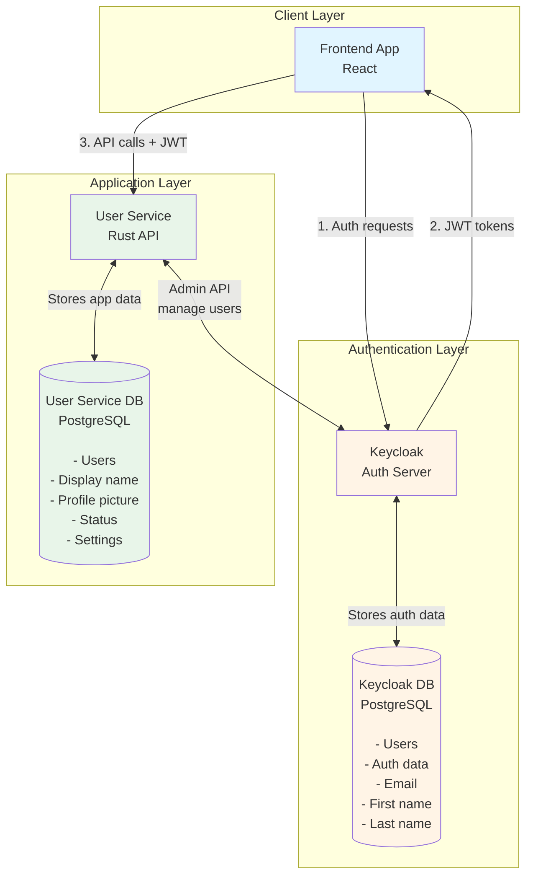
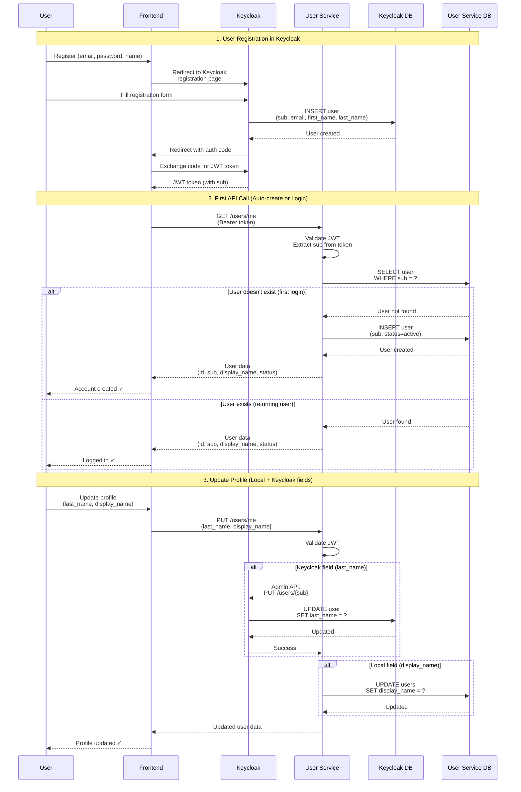

# User Service

Rust microservice for user management with Keycloak integration.

## Architecture Overview



## Registration & Authentication Flow



## Pre-commit Hooks

First, install pre-commit following the [official installation guide](https://pre-commit.com/#install).

Then, install the hooks in your repository:

```bash
pre-commit install
```

### Usage

The hooks run automatically before each `git commit`. To run them manually:

```bash
# Run on all files
pre-commit run --all-files

# Run on staged files only
pre-commit run

# Run a specific hook
pre-commit run fmt
pre-commit run clippy
```

## Local Development

### With Docker (recommended)

```bash
cp .env.example .env
docker compose up -d --build
docker compose exec user-api user-api migrate
```

This starts Keycloak, two PostgreSQL databases (one for Keycloak, one for the User Service), and the User API.

### With Cargo (for development)

Start the dependencies (databases and Keycloak):

```bash
cp .env.example .env
docker compose up -d keycloak keycloak-db user-db
```

Run the migrations and start the API:

```bash
cargo run -- migrate
cargo run
```

Services:
- **User API**: http://localhost:3000
- **Health check**: http://localhost:3001/health
- **Keycloak**: http://localhost:8080

### API Documentation

Interactive API documentation is available via Scalar at:

**http://localhost:3000/docs**

## CLI Commands

The `user-api` binary supports the following commands:

| Command | Description |
|---------|-------------|
| `migrate` | Run database migrations |
| `run` | Start the API server (default) |

## Environment Variables

| Variable | Description | Example |
|----------|-------------|---------|
| `KEYCLOAK_DB` | Keycloak database name | `keycloak` |
| `KEYCLOAK_DB_USER` | Keycloak database user | `keycloak` |
| `KEYCLOAK_DB_PASSWORD` | Keycloak database password | `keycloak` |
| `KEYCLOAK_ADMIN` | Keycloak admin username | `admin` |
| `KEYCLOAK_ADMIN_PASSWORD` | Keycloak admin password | `admin` |
| `KEYCLOAK_URL` | Keycloak external URL (for browser) | `http://localhost:8080` |
| `KEYCLOAK_INTERNAL_URL` | Keycloak internal URL (for service) | `http://keycloak:8080` |
| `KEYCLOAK_REALM` | Keycloak realm name | `myrealm` |
| `KEYCLOAK_CLIENT_ID` | Keycloak client ID | `user-service` |
| `KEYCLOAK_CLIENT_SECRET` | Keycloak client secret | `your-client-secret` |
| `USER_DB` | User service database name | `userservice` |
| `USER_DB_USER` | User service database user | `userservice` |
| `USER_DB_PASSWORD` | User service database password | `userservice` |
| `JWT_SECRET` | JWT secret key | `your-jwt-secret-key` |
